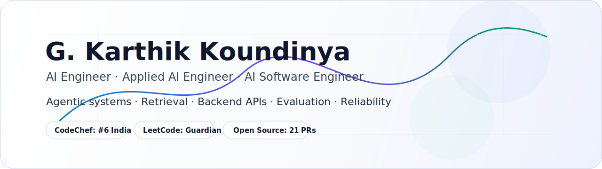

<picture>
  <source media="(prefers-color-scheme: dark)" srcset="./assets/profile/hero-dark.svg">
  <source media="(prefers-color-scheme: light)" srcset="./assets/profile/hero-light.svg">
  
</picture>

  
  
  
  
  
  

## Building AI Infrastructure and Performance Layers

I bridge the gap between elite algorithmic problem-solving and production systems engineering[cite: 2]. My core focus lies at the intersection of autonomous AI execution layers, high-throughput RAG infrastructure, and performance-tuned backend systems[cite: 2].

I am looking for roles around **AI Engineering**, **AI Infrastructure Engineering**, **AI Software Engineering**, and **High-Performance Backend Engineering for AI Products**[cite: 2].

| Signal | Proof |
|---|---|
| **Agentic Systems** | Dual-agent parent-child orchestration (AlgoSentinel), LangGraph state routing, multi-agent supply-chain monitoring workflows. |
| **Retrieval & Grounding** | Hybrid token/vector engines, z-score fusion retrieval, cross-encoder reranking, and deterministic citation validation[cite: 2]. |
| **Systems & Backend Depth** | Custom Kubernetes CRD controllers (Go), edge-native middleware pipelines (TS), async event loops, and optimized PostgreSQL routing[cite: 2]. |
| **Competitive Programming** | CodeChef **#6 India / #76 Global**, LeetCode **Guardian (Top 0.9% globally)**, Codeforces Grandmaster[cite: 2]. |
| **Open Source** | **35 authored PRs across 22 repositories (14 merged)** resolving parser grammar, resource safety errors, and concurrency panics. |

## Flagship Systems

| Project | Why it matters |
|---|---|
| [AlgoSentinel](https://github.com/G26karthik/algosentinel) | Autonomous multi-agent PR review daemon. Profiles changed code functions inside ephemeral Docker sandboxes to map growth curves and catch algorithmic complexity regressions ($O(n) \rightarrow O(n^2)$). |
| [EdgeSentinel](https://github.com/G26karthik/EdgeSentinel) | Edge-native bot detection engine deployed directly to Cloudflare Workers with sub-10ms overhead. Deploys a 5-tier request classification cascade backed by Durable Objects rate-limiting to eliminate KV state race conditions. |
| [Grounded Support Triage](https://github.com/G26karthik/grounded-support-triage) | Multi-domain LangGraph orchestration pipeline featuring hybrid vector/BM25 search, unified z-score fusion, and a programmatic verification layer checking hard facts to completely eliminate model hallucinations[cite: 2]. |
| [TurboQuant KV Cache](https://github.com/G26karthik/turboquant-kvcache) | PyTorch research implementation reproducing online vector quantization paper. Achieved a **3.3× KV cache compression ratio** on GPT-2 Medium with only a +6.1% change in perplexity performance metrics. |
| [MindSafe](https://github.com/G26karthik/MindSafe) | Privacy-first clinical mental health screening dApp. Runs adaptive inference entirely client-side with zero data persistence, minting cryptographic commitment hashes on-chain via Midnight Network zero-knowledge (ZK) proofs. |
| [sandbox-warm-pool-controller](https://github.com/G26karthik/sandbox-warm-pool-controller) | Kubernetes custom CRD controller built in Go that implements a 6-state pod lifecycle pool to pre-warm hardware-isolated runtimes (gVisor/Kata), completely eliminating 1–5s container cold-start delays. |

*Secondary Implementations:* [Avia Search](https://github.com/G26karthik/Avia), [FounderOS](https://github.com/G26karthik/FounderOS), [Nexus Feed](https://github.com/G26karthik/Nexus-Feed), [PinPoint AI](https://github.com/G26karthik/Pin-Point-New-Gen-Logistics-App), [BTIFIT Platform](https://github.com/G26karthik/BTIFIT), [AI Traffic Shaper](https://github.com/G26karthik/AI-Network-Traffic-Shaper).

## Open Source Footprint

### 🔸 Merged Production Code
| Repository | PR | Area | Impact |
|------------|-----|------|--------|
| [mem0ai/mem0](https://github.com/mem0ai/mem0) | [#3549](https://github.com/mem0ai/mem0/pull/3549) | AI Data Infrastructure | Engineered and integrated the native Azure AI Search vector database connector layer within the TypeScript SDK core (~646 LOC contribution). |
| [sqlfluff/sqlfluff](https://github.com/sqlfluff/sqlfluff) | [#7163](https://github.com/sqlfluff/sqlfluff/pull/7163) | Parser Engineering | Extended the core PostgreSQL dialect grammar engine rules to properly parse explicit programmatic `OPERATOR(schema.op)` syntax overrides. |
| [pandas-dev/pandas](https://github.com/pandas-dev/pandas) | [#62592](https://github.com/pandas-dev/pandas/pull/62592) | Core Test Engineering | Developed robust regression test suites safeguarding PyArrow datetime data-type data merges against unexpected duplicate-key drops. |
| [interviewstreet/hiring-agent](https://github.com/interviewstreet/hiring-agent) | [#133](https://github.com/interviewstreet/hiring-agent/pull/133) | Performance & Safety | Eliminated critical background memory leak vectors by converting raw PyMuPDF file object tracking loops into safe context-managed lifecycles[cite: 2]. |
| [interviewstreet/hiring-agent](https://github.com/interviewstreet/hiring-agent) | [#129](https://github.com/interviewstreet/hiring-agent/pull/129) | System Robustness | Enforced explicit UTF-8 encoding patterns on backend cache file write operations to guarantee Windows file system Unicode execution safety[cite: 2]. |

### 🔸 Active Upstream Engineering (Open Review)
*   **Telemetry Streaming (`kubeflow/sdk#436`):** Refactoring `LocalJob.logs(follow=True)` execution loops into native generator streams to remove hidden stdout-blocking side effects and enable real-time training tracking telemetry.
*   **Symbolic Mathematics (`sympy/sympy#29605`):** Patching `refine_sign()` logic architectures to fix assumption handling constraints for unallocated plain variables.
*   **Test Correctness (`modelpack/model-spec#211`):** Resolving silent test passes on malformed JSON configuration examples by fixing error variable conditional evaluations.

  
  

