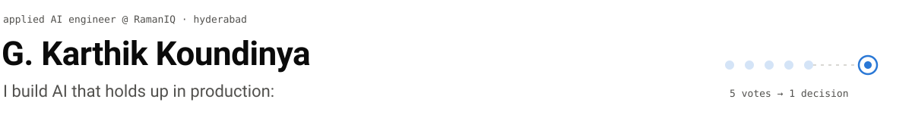

<picture>
  <source media="(prefers-color-scheme: dark)" srcset="./assets/profile/hero-dark.svg">
  
</picture>

<samp>
  <a href="https://g26karthik.github.io/Portfolio/">portfolio</a> ·
  <a href="https://linkedin.com/in/g-karthik26">linkedin</a> ·
  <a href="mailto:karthikofficialmain@gmail.com">email</a> ·
  <a href="https://drive.google.com/file/d/1WvDCHCJNnAgBldLk-3jFeYOPITHGz-qS/view">resume</a> ·
  <a href="https://leetcode.com/u/G26KarthikK/">leetcode 2665</a> ·
  <a href="https://www.codechef.com/users/g26karthikk">codechef #6 india</a>
</samp>

I build AI systems that have to be right: agents, retrieval, and the evals that keep them honest. CS undergrad in Hyderabad (2027). Open to AI and backend engineering roles.

### Recently

- **20th of 1,983** at HackerRank Orchestrate, Aug 2026. I built a [WhatsApp notification router](https://github.com/G26karthik/whatsapp-notification-router) that decides notify, digest or mute for each user, then wrote up [why it wasn't 1st](https://github.com/G26karthik/whatsapp-notification-router#post-mortem-why-20th-and-not-1st).
- **12th globally** at Orchestrate, May 2026, out of 12,885 developers: [grounded-support-triage](https://github.com/G26karthik/grounded-support-triage), LangGraph and hybrid RAG with a citation critic.
- **Hecta Proptech**: CatBoost models and hybrid RAG over 175K+ auction notices, cutting manual review by 80%.
- **[Nishchay](https://github.com/G26karthik/Nishchay)**: a cash-on-delivery risk engine that prices each decision in rupees. It nets ₹72.9L over 44,288 held-out orders.
- **[Langfuse security Hall of Fame](https://langfuse.com/security/responsible-disclosure#hall-of-fame)** for a responsibly disclosed access-control bug.

### Selected work

| | |
|---|---|
| [algosentinel](https://github.com/G26karthik/algosentinel) | An agent that profiles PR code in Docker sandboxes to catch O(n) → O(n²) regressions |
| [kvquant-lab](https://github.com/G26karthik/kvquant-lab) | 4.65× KV-cache compression at near-baseline perplexity, extending TurboQuant |
| [EdgeSentinel](https://github.com/G26karthik/EdgeSentinel) | Bot detection on Cloudflare Workers with under 10 ms of overhead per request |
| [sandbox-warm-pool-controller](https://github.com/G26karthik/sandbox-warm-pool-controller) | A Kubernetes controller in Go that pre-warms gVisor and Kata sandbox pods |
| [Forensic-Evidence-Indexer](https://github.com/G26karthik/Forensic-Evidence-Indexer) | A C++17 streaming hash and dedupe pipeline with backpressure |

### Open source

10 merged PRs to [pandas](https://github.com/pandas-dev/pandas/pulls?q=is%3Apr+author%3AG26karthik), [mem0](https://github.com/mem0ai/mem0/pull/3549), [matplotlib](https://github.com/matplotlib/matplotlib/pull/30639), [sktime](https://github.com/sktime/sktime/pull/8923), [SQLFluff](https://github.com/sqlfluff/sqlfluff/pull/7163) and HackerRank's [hiring-agent](https://github.com/interviewstreet/hiring-agent/pulls?q=is%3Apr+author%3AG26karthik), projects with 165K+ stars between them. [All my PRs →](https://github.com/search?q=author%3AG26karthik+is%3Apr&type=pullrequests&s=created&o=desc)
